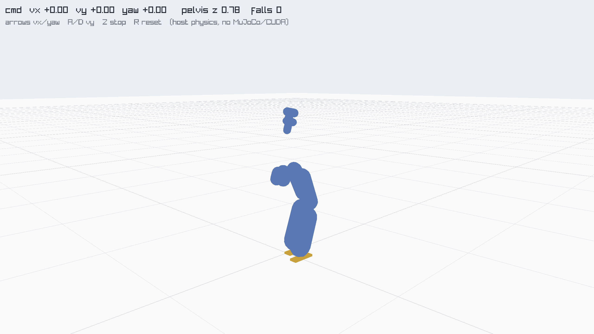

# nanoG1

**Train a [Unitree G1](https://www.unitree.com/g1) humanoid to walk in under 60 seconds, on a single GPU — pure RL, from scratch.**

No demonstrations, no reference gait, no motion capture. The policy starts from noise and learns to walk from reward alone in **~59 seconds** of wall-clock training (~75M samples at 1.28M samples/s) for about **$0.17** on one GPU.

🤖 **[Live demo — drive the trained G1 in your browser](https://nanog1.com)** &nbsp;·&nbsp; 🤗 **[Model on Hugging Face](https://huggingface.co/kingJulio/nanoG1)**



This is to robot locomotion what [nanoGPT](https://github.com/karpathy/nanoGPT) is to language models: the smallest, most legible thing that actually works, that you can read top-to-bottom and run yourself.

---

## Quickstart

```bash
git clone https://github.com/kingjulio8238/nanoG1 && cd nanoG1
bash speedrun.sh
```

That's it. `speedrun.sh` syncs the Python env, fetches the engine, trains the G1 on a local CUDA GPU such as a DGX Spark, gates the result, and drops the trained policy at `assets/nanoG1.bin`.

**Prereqs:** [`uv`](https://docs.astral.sh/uv), `git`, NVIDIA drivers, and CUDA devel tools (`nvidia-smi` + `nvcc`). On a Wendy-managed Spark, use the Docker/Wendy path below so the CUDA build stack is provisioned in the container.

Want to turn the dials yourself instead of one-shotting it:

```bash
bash setup.sh                          # fetch the G1-specialized engine (pinned fork)
python train_local.py --smoke          # validate the whole stack first
python train_local.py                  # the <60s walk -> assets/nanoG1.bin
python eval.py assets/nanoG1.bin       # quality gate: does it actually walk?
bash web/build_demo.sh && ./build/g1demo assets/nanoG1.bin   # watch it locally
```

If CUDA auto-detection picks the wrong architecture, pass it explicitly:
`NANOG1_NVCC_ARCH=sm_120 python train_local.py`.

### Test RGB/depth perception in simulation

The walking policy does not need retraining to test the next autonomy layer.
Use the MuJoCo perception sandbox to mount a virtual RGB + depth camera near the
G1 head, render a moving person stand-in, and emit the high-level walking command
that would be sent into the RL command wrapper:

```bash
uv sync --extra perception
G1_MODEL_DIR=artifacts/perception-sim/model-mujoco39 .venv/bin/python tools/extract_g1_model.py
.venv/bin/python scripts/g1_perception_sim.py \
  --model artifacts/perception-sim/model-mujoco39/g1.mjb \
  --out artifacts/perception-sim/latest
```

Outputs:

- `artifacts/perception-sim/latest/g1_head_rgb_depth_follow.mp4`
- `artifacts/perception-sim/latest/head_rgb.mp4`
- `artifacts/perception-sim/latest/head_depth_red_close_blue_far.mp4`
- `artifacts/perception-sim/latest/rgb_depth_000.png`
- `artifacts/perception-sim/latest/commands.jsonl`

This is a perception/control-glue sandbox, not a replacement for the fast
training engine. Planner modes:

```bash
# Existing oracle/math planner: uses hidden sim state for distance/bearing.
.venv/bin/python scripts/g1_perception_sim.py --planner oracle

# Camera-only local test: reads only RGB + depth frames, no world coords.
.venv/bin/python scripts/g1_perception_sim.py \
  --planner vision-heuristic \
  --out artifacts/perception-sim/vision_only_smoke

# Real VLM planner: sends only RGB + depth images to the model and expects JSON
# velocity commands for the RL walking wrapper.
OPENAI_API_KEY=... .venv/bin/python scripts/g1_perception_sim.py \
  --planner openai-vlm \
  --planner-period 15 \
  --vlm-model gpt-5.5 \
  --out artifacts/perception-sim/openai_vlm
```

`commands.jsonl` records `planner_inputs`; for `vision-heuristic` and
`openai-vlm`, that list is `["rgb", "depth_rgb"]`.

### Visualize live G1 follow perception in Foxglove

Run the local Foxglove bridge from the Mac while the G1 is reachable:

```bash
.venv/bin/python scripts/live_g1_foxglove_bridge.py \
  --robot-host 192.168.0.108 \
  --foxglove-port 8765 \
  --rgb-source front-rtsp \
  --fps 3 \
  --conf 0.05
```

Then open:

```text
https://app.foxglove.dev?ds=foxglove-websocket&ds.url=ws%3A%2F%2F127.0.0.1%3A8765
```

Published topics:

- `/g1/front/rgb`: compressed front RGB image
- `/g1/front/annotations`: human box annotation
- `/g1/realsense/depth_color`: colorized RealSense depth image
- `/g1/realsense/depth_annotations`: human-depth and closest-object markers
- `/g1/follow/state`: JSON state for plotting target distance, safety stop,
  and `vx/vy/wz/stop`

This bridge is dry-run only. It publishes visualization and proposed commands,
but does not send Unitree motion commands.

### Train a native visual command policy

To keep the 1.09B locomotion policy intact, train the visual layer separately:

```bash
.venv/bin/python scripts/train_visual_command_policy.py \
  --base-walker artifacts/protected/2026-06-21/1091043328/checkpoint.bin \
  --encoder features \
  --steps 1200 \
  --batch-size 1024 \
  --eval-batch-size 4096 \
  --hidden-dim 64 \
  --learning-rate 0.01 \
  --target-mode moving \
  --trajectory-len 24 \
  --out artifacts/visual-command/1091043328-feature-bootstrap
```

This produces `visual_command_policy.npz`, `metrics.jsonl`, and `summary.json`.
The frozen walker is not modified. The learned layer reads only low-resolution
RGB/depth-derived inputs and outputs `vx`, `vy`, `wz`, and `stop_probability`.
With `--target-mode moving`, batches are sampled from random moving target
trajectories: random start positions, random velocities, direction changes,
boundary bounces, and occasional target loss.

For a longer training-ready run with periodic checkpoints and heartbeat files:

```bash
bash scripts/run_visual_command_training.sh artifacts/visual-command/1091043328-train
```

Useful files while it runs:

- `visual_training_heartbeat.json`
- `visual_training_heartbeat.jsonl`
- `metrics.jsonl`
- `latest_policy.npz`
- `best_policy.npz`
- `latest_checkpoint.json`
- `checkpoints/step_*.npz`

Resume the same run:

```bash
VISUAL_COMMAND_RESUME=1 \
VISUAL_COMMAND_STEPS=40000 \
bash scripts/run_visual_command_training.sh artifacts/visual-command/1091043328-train
```

Check run status:

```bash
.venv/bin/python scripts/visual_command_status.py artifacts/visual-command/1091043328-train
```

Evaluate a saved visual policy:

```bash
.venv/bin/python scripts/train_visual_command_policy.py \
  --eval-only artifacts/visual-command/1091043328-train/best_policy.npz \
  --out artifacts/visual-command/1091043328-train
```

### Run training on a Wendy Spark

This repo includes a Spark container path:

```bash
wendy --device spark-edeb.local device ps --json
wendy run --device spark-edeb.local --prefix . --dockerfile Dockerfile.spark --detach --restart-unless-stopped -y
```

The Spark entrypoint runs the full 12-hour training job by default and writes live progress files into `/outputs`. If you need to pass extra trainer args, keep the run detached:

```bash
wendy run --device spark-edeb.local --prefix . --dockerfile Dockerfile.spark --detach --restart-unless-stopped \
  --user-args=/app/scripts/spark_entrypoint.sh \
  --user-args=--full \
  -y
```

Training writes `setup.log`, `training_heartbeat.json`, `training_heartbeat.jsonl`, `supervisor_heartbeat.json`, `progress_watchdog.json`, `fall_metrics.jsonl`, `checkpoint_eval.jsonl`, `checkpoint_eval_latest.json`, `train.log`, `result.json`, and checkpoints to the persistent `/outputs` volume declared in `wendy.json`. Treat `progress_watchdog.json` as the liveness source: it only resets on real trainer evidence such as new metrics/log output, newer checkpoint counters, or active GPU work during the grace window. Treat `checkpoint_eval_latest.json` as the policy-quality source: it includes forward/stand/push eval so a run cannot silently become a stand-still policy.

To render a video that visibly marks deterministic side/down pushes, use:

```bash
bash scripts/record_pushed_demo_video.sh outputs/latest.bin outputs/g1_demo_pushed.mp4
```

### Run it on a real robot

Put the policy on a physical **Unitree G1**:

```bash
bash setup.sh                 # engine fork (for puffernet.h), once
bash deploy/build_policy.sh   # build the inference shim
python deploy/deploy_g1.py --net eth0          # walk in place
python deploy/deploy_g1.py --net eth0 --teleop # WASD drive
```

It runs a 50 Hz loop over Unitree's low-level DDS interface (`unitree_sdk2py`):
robot state → the exact trained observation → policy → joint PD targets, with a
zero-torque → move-to-home → policy safety sequence. **The policy is sim-trained —
hang the robot from a gantry and keep the E-stop in hand.** Full guide and the
hardware checklist: [`deploy/README.md`](deploy/README.md).

---

## What you get

| | |
|---|---|
| **Time-to-walk** | **58.9 s** in the original reference run (75M samples @ 1.28M SPS) |
| **Cost-to-walk** | Local Spark run; no cloud GPU billing path remains in this repo |
| **Method** | PPO + V-trace, **pure RL from scratch** — no demos, no reference motion |
| **Physics** | MuJoCo-grade soft-convex contact, friction cones, domain randomization |
| **Engine throughput** | **8.9M physics steps/s** on one GPU (see chart below) |

### Engine throughput — G1 reference run, physics steps/s

```
nanoG1        ████████████████████████████████████  8.9M
mujoco_warp   ████████████████                       4.0M
Genesis*      █████████                               2.3M
MJX           ████▌                                   1.1M
```

\* Genesis runs its own (non-MuJoCo) solver — a competitor datapoint, not matched-physics. See [RESULTS.md](RESULTS.md) for exact settings, the matched-physics comparison (1.6× warp), and provenance.

---

## How it works

The thesis: MuJoCo's physics isn't inherently slow for RL — it's just never been **specialized**. nanoG1 compiles the simulator *per-robot*. For a fixed G1, the kinematic tree, contact set, and solver layout are compile-time constants, so the whole step inlines into straight-line CUDA with no runtime dispatch, no broadphase, and a fixed-iteration solver. That's where the throughput comes from — not from cheapening the physics (it's validated trajectory-by-trajectory against the MuJoCo C engine).

Two ingredients make it learn to walk this fast:

1. **A G1-specialized GPU engine** — a [pinned PufferLib fork](https://github.com/kingjulio8238/PufferLib/tree/g1) that bakes the G1 in at compile time (zero Python in the hot loop). `recipe.py` pins the exact commit.
2. **A left↔right symmetry loss** (N1, after [Yu et al. 2018](https://arxiv.org/abs/1801.08093)) — regularizing the policy toward a mirror-symmetric gait cut samples-to-walk ~26% *and* smoothed the gait. That's the single biggest lever.

Everything else — the reward weights, PPO/Muon hyperparameters, the dt/decimation/solver settings — lives in **one file, [`recipe.py`](recipe.py)**. That's the dial you turn.

---

## Repo layout

```
recipe.py        the frozen winning recipe — the one dial you turn
train_local.py   local/Spark CUDA trainer: builds the engine, trains, writes the walk checkpoint
eval.py          quality gate — runs the host-physics battery, checks it walks
speedrun.sh      one command: env -> engine -> train -> gate
setup.sh         fetch the pinned G1 engine (for local demo/eval builds)
web/             browser demo (raylib + the policy, host physics) -> WASM
deploy/          run the policy on a REAL Unitree G1 (unitree_sdk2py, low-level DDS)
bench/           notes for benchmark scripts that were removed from this Spark-first checkout
tools/           bake the G1 model + meshes from MuJoCo (assets are committed)
assets/nanoG1.bin   the trained <60s policy (655 KB)
```

---

## Credits

**nanoG1's engine is [PufferLib](https://github.com/PufferAI/PufferLib).** The
whole approach — compile-time per-environment specialization, zero Python in the
hot loop, the CUDA trainer, the [Muon](https://github.com/PufferAI/PufferLib)
optimizer path, PufferNet — is PufferLib's, and the G1 simulator is built as a
PufferLib environment. nanoG1 would not exist without it. Huge thanks to
[@jsuarez5341](https://github.com/jsuarez5341) and the PufferLib contributors.
PufferLib is MIT-licensed; we carry its license forward.

Also built on [MuJoCo](https://github.com/google-deepmind/mujoco) physics
semantics, the [Unitree G1](https://github.com/google-deepmind/mujoco_menagerie)
from MuJoCo Menagerie, and [raylib](https://github.com/raysan5/raylib) for the
demo. Inspired by
[nanoGPT](https://github.com/karpathy/nanoGPT) and
[nanochat](https://github.com/karpathy/nanochat).

MIT licensed.
